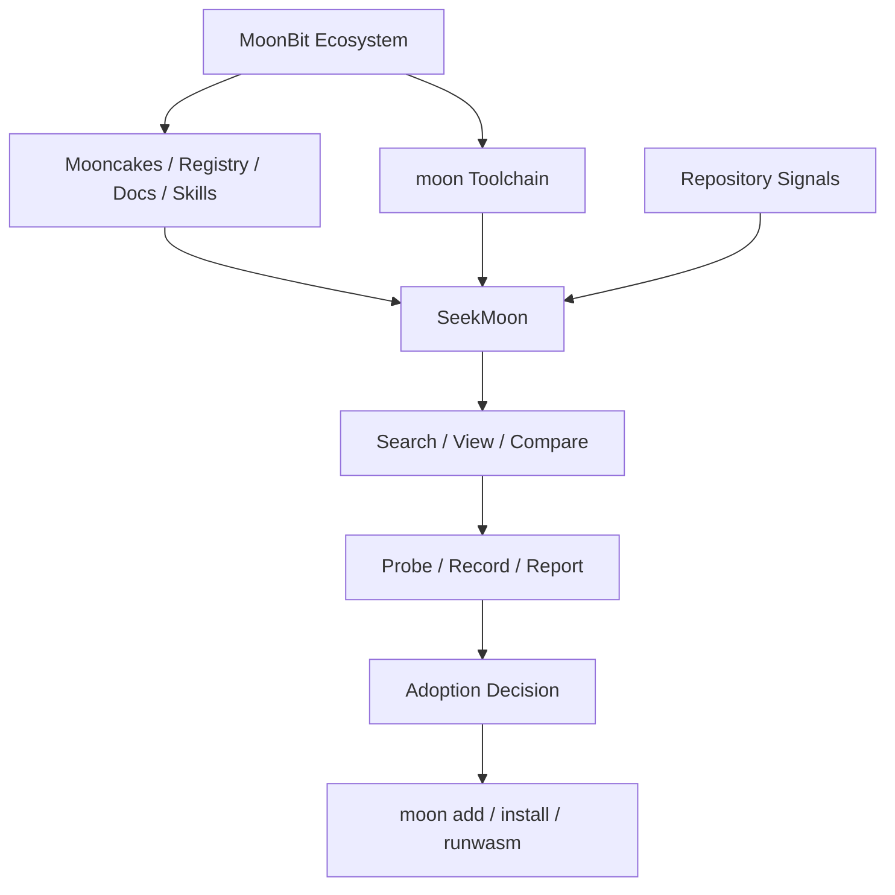

# SeekMoon

[](https://github.com/MichengLiang/seekmoon/actions/workflows/ci.yml)
[](https://github.com/MichengLiang/seekmoon/actions/workflows/pages.yml)
[](LICENSE)
[](https://pkg.go.dev/github.com/MichengLiang/seekmoon)

English | [简体中文](README.zh-CN.md)

SeekMoon is a MoonBit package discovery workbench. It helps dependency
consumers discover candidate packages, inspect evidence, run local validation,
record adoption judgments, and render investigation reports before adding a
dependency.

The Go CLI reads Mooncakes API data, Mooncakes assets, MoonBit local toolchain
state, project context, local registry/cache state, repository signals, and
project records. Upstream facts remain separate from local derived evidence, so
search, inspection, comparison, probe, record, report, JSON, jq, shape, schema,
and error output share the same evidence-state vocabulary.

The repository also contains the AsciiDoc bookshelf that defines the surrounding
evidence model, command contracts, output contracts, implementation architecture,
and acceptance journeys for SeekMoon and the package-reuse research series.

## Links

| Item | Location |
| --- | --- |
| GitHub | <https://github.com/MichengLiang/seekmoon> |
| Go module | `github.com/MichengLiang/seekmoon` |
| Published bookshelf | <https://michengliang.github.io/seekmoon/> |
| License | [Apache-2.0](LICENSE) |
| Contributing | [CONTRIBUTING.md](CONTRIBUTING.md) |
| Security | [SECURITY.md](SECURITY.md) |
| Support | [SUPPORT.md](SUPPORT.md) |

## Documentation

| Document | Purpose |
| --- | --- |
| [Package Reuse Ecosystem](https://michengliang.github.io/seekmoon/books/08-package-reuse-ecosystem/book.html) | Conceptual background for package discovery, package management, lifecycle, evidence, evaluation, and governance. |
| [SeekMoon: MoonBit Package Discovery Workbench](https://michengliang.github.io/seekmoon/books/09-seekmoon-cli-discovery-workbench/book.html) | Maintained specification for SeekMoon's consumer-side CLI workflow, evidence model, command surface, and output contracts. |

## Project Position

SeekMoon sits between MoonBit package ecosystem facts and a consumer's dependency
adoption decision. It does not replace `moon`, Mooncakes, or the registry. It
reads Mooncakes data, local MoonBit toolchain state, repository signals, and
project records, then projects them into a reproducible CLI investigation
workflow. Upstream facts remain separate from local derived evidence, with
missing, unknown, and unverified states kept explicit.



## Repository Layout

| Path | Purpose |
| --- | --- |
| `cmd/seekmoon/` | CLI process entrypoint. |
| `internal/` | Go implementation packages for CLI, services, sources, stores, output, contracts, and help text. |
| `tests/` | Acceptance, black-box, integration, and journey tests. |
| `bookshelf/` | AsciiDoc bookshelf source and build workspace. |
| `docs/` | Research notes, raw investigation material, and validation reports. The maintained documentation surface is the published bookshelf, especially books 08 and 09. |
| `spike/` | Exploratory MoonBit and CLI probes. |
| `justfile` | Local Go quality-gate entrypoints. |

## CLI Quick Start

Run from source:

```bash
go run ./cmd/seekmoon --help
```

Build a local binary:

```bash
go build -o seekmoon ./cmd/seekmoon
./seekmoon --help
```

Start with command help before using a command for the first time:

```bash
seekmoon search --help
seekmoon probe --help
seekmoon record --help
```

Common investigation path:

```text
doctor -> sync -> search -> view/api/source/compare -> probe -> record -> report
```

Example session:

```bash
seekmoon doctor
seekmoon sync
seekmoon search markdown --target js
seekmoon view 1
seekmoon api 1 --package mizchi/markdown/src/api
seekmoon compare 1 2
seekmoon probe 1 --target js
seekmoon record 1 --conclusion continue-verification
seekmoon report --format markdown
```

`search` and `skill search` write numbered candidates into the current
project's default session. Later commands can use numbers such as `1` or `2`.
When a number is unavailable, run search again or pass a full coordinate such as
`owner/module@version`.

## Commands

| Command | Action |
| --- | --- |
| `doctor` | Check local MoonBit, registry, network, and project-context evidence. |
| `sync` | Create a dated evidence snapshot. |
| `search` | Search library module candidates. |
| `view` | View one library module evidence profile. |
| `api` | View one package API profile. |
| `source` | Locate source material for a registry-published module version. |
| `skill search` | Search executable skill entries from the Skills API. |
| `skill view` | View one executable skill profile. |
| `compare` | Compare multiple candidates on one evidence surface. |
| `probe` | Run local validation for one candidate. |
| `record` | Save an adoption judgment. |
| `report` | Render an investigation report from records and evidence references. |
| `raw` | Read an upstream source payload without normalization. |

## Output Modes

Every public output command supports the common output modes:

| Mode | Purpose |
| --- | --- |
| default pretty text | Terminal reading. Do not use it as a parsing interface. |
| `--json` | Command JSON projection for scripts and automation. |
| `--jq <expr>` | Evaluate a jq expression against the command JSON projection. |
| `--shape` | Show the command JSON field tree without running the data action. |
| `--schema` | Show the command JSON Schema without running the data action. |

Examples:

```bash
seekmoon search argparse --json
seekmoon search argparse --jq '.results[].module'
seekmoon search --shape
seekmoon search --schema
```

## Local State

SeekMoon separates project investigation state from reusable remote cache.

Project state lives under the current project's `.seekmoon/` directory:

```text
.seekmoon/
  snapshots/
  sessions/
  records/
  reports/
  probes/
  sources/
  logs/
```

Reusable cache lives under the user's XDG cache directory:

```text
$XDG_CACHE_HOME/seekmoon/
  mooncakes/
  assets/
  github/
```

## Development

SeekMoon uses Go for the CLI and pnpm for the bookshelf build.

Required tools for the full local gate:

| Tool | Purpose |
| --- | --- |
| Go 1.26.x | Build, test, coverage, module checks, and Go tooling. |
| `just` | Local quality-gate orchestration. |
| `gofumpt` | Go formatting gate. |
| `golangci-lint` | Aggregate lint gate. |
| `gotestsum` | Readable Go test output. |
| `govulncheck` | Reachable Go vulnerability exposure check. |
| `goreleaser` | Release configuration and snapshot artifact checks. |

Install Go module dependencies:

```bash
go mod download
```

Run the main checks:

```bash
just fmt-check
just lint
just test
just test-race
just cover
just vuln
just mod-check
just release-check
```

Run the full local gate:

```bash
PATH="$(go env GOPATH)/bin:$PATH" just ci
```

`just cover` writes `.artifacts/coverage.out`. The file is generated output and
is ignored by Git.

Integration tests that use real network, GitHub, Moon CLI commands, source
downloads, or probe mutation are opt-in. Default test runs use fixtures, fake
source readers, fake filesystems, and fake command runners.

## Continuous Integration

The `CI` workflow runs two jobs:

| Job | Checks |
| --- | --- |
| `go` | `gofumpt`, `golangci-lint`, unit tests, race tests, coverage, `govulncheck`, module integrity, and `goreleaser check`. |
| `bookshelf` | pnpm install, structural check, and bookshelf build. |

The `Pages` workflow builds and deploys `bookshelf/build/html` to GitHub Pages
from the `main` branch or a manual dispatch.

## Bookshelf

The source catalog is [bookshelf/catalog.adoc](bookshelf/catalog.adoc).

Build the bookshelf locally:

```bash
cd bookshelf
pnpm install
pnpm run check
pnpm run build
```

Generated HTML is written to `bookshelf/build/html/`.

## Release

Release configuration lives in [.goreleaser.yaml](.goreleaser.yaml).

Create a local snapshot release:

```bash
just release-snapshot
```

Tagged releases are published by the `Release` workflow when a `v*` tag is
pushed. Release notes come from [CHANGELOG.md](CHANGELOG.md).

The release build targets Linux, macOS, and Windows on `amd64` and `arm64`.

## License

Apache-2.0. See [LICENSE](LICENSE).
