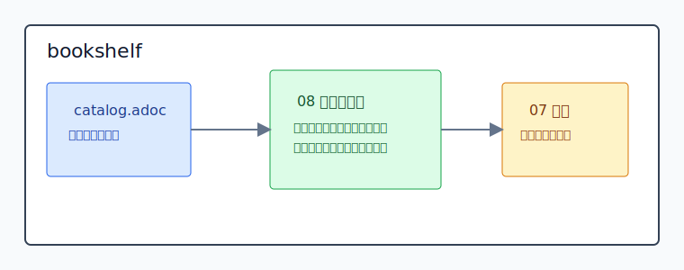

= 包复用与 MoonBit 工具书架
弥澄亮 <t103ooooo@stu.mju.edu.cn>
v1.0, 2026-06
:toc: left
:toclevels: 2
:icons: font
:experimental:
:idprefix:
:idseparator: -

本书架包含结构化写作规范、包复用生态模型和 MoonBit 包发现工具书。07 号书定义书写结构规则；08 号书定义通用包复用生态；09 号书定义 SeekMoon 的 MoonBit 包发现工作台；10 号书把 SeekMoon 实现材料分解为可执行和可审核的 WBS 工作包。

== 书籍入口

[cols="1,3", options="header"]
|===
|书籍 |对象

|xref:books/07-structured-writing-conventions/book.adoc[07 结构化书写约定]
|定义标题层级、stable ID、xref、rel、字段、索引词和附录等结构规则。

|xref:books/08-package-reuse-ecosystem/book.adoc[08 包复用生态]
|定义 Package Discovery 与 Package Management 的对象模型、生命周期、证据源、变量体系、安全治理和评价尺度。

|xref:books/09-seekmoon-cli-discovery-workbench/book.adoc[09 SeekMoon：MoonBit 包发现工作台]
|定义消费者侧 MoonBit 包发现 CLI 的证据来源边界、canonical 数据模型、命令契约、输出契约、行动轨迹和验收条件。

|xref:books/10-seekmoon-wbs-work-packages/book.adoc[10 SeekMoon：WBS 工作包分解书]
|定义 SeekMoon Go implementation 的全局必读上下文、工作包依赖图、工作包边界、测试责任、审核尺子和完成证据。
|===

== 按任务进入

[cols="1,2,2", options="header"]
|===
|任务 |入口 |获得的判断

|维护 AsciiDoc 书稿结构
|xref:books/07-structured-writing-conventions/book.adoc[07 结构化书写约定]
|标题、xref、rel、role、附录、术语表和索引的源文档规则。

|理解包复用生态
|xref:books/08-package-reuse-ecosystem/book.adoc#reader-paths[读者路径]、xref:books/08-package-reuse-ecosystem/book.adoc#package-level-evaluation[包级评价]
|候选包是否适合当前项目，以及哪些硬约束不能被下载量、Star 或文档质量抵消。

|设计 registry、index 或评价模型
|xref:books/08-package-reuse-ecosystem/book.adoc#part-object-model[对象模型]、xref:books/08-package-reuse-ecosystem/book.adoc#part-evidence-measurement[证据与度量]、xref:books/08-package-reuse-ecosystem/book.adoc#appendix-structure-vocabulary[结构词表]
|Registry、Index、Resolver、Discovery Surface、Audit Surface 和评价输出的职责边界。

|让源码项目成为可消费的包
|xref:books/08-package-reuse-ecosystem/book.adoc#manifest-registry-index-model[Manifest、Registry 与 Index]、xref:books/08-package-reuse-ecosystem/book.adoc#part-lifecycle[生命周期]
|源码项目如何成为别人能发现、理解、信任、安装和维护的包。

|执行 MoonBit 包发现调查
|xref:books/09-seekmoon-cli-discovery-workbench/book.adoc#library-discovery-journey[Library Discovery Journey]、xref:books/09-seekmoon-cli-discovery-workbench/book.adoc#command-map[Command Map]
|从 query 到候选、证据下钻、本地验证、采纳记录和报告的完整动作链。

|实现 SeekMoon CLI
|xref:books/09-seekmoon-cli-discovery-workbench/book.adoc#go-architecture-premises[Architecture Premises]、xref:books/09-seekmoon-cli-discovery-workbench/book.adoc#go-module-layout[Go Module Layout]、xref:books/09-seekmoon-cli-discovery-workbench/book.adoc#go-engineering-quality-toolchain[Engineering Quality Toolchain]、xref:books/09-seekmoon-cli-discovery-workbench/book.adoc#appendix-go-implementation-dependencies[附录 F：Go 实现依赖图]、xref:books/09-seekmoon-cli-discovery-workbench/book.adoc#appendix-go-engineering-toolchain[附录 G：Go 工程工具链]
|Go module layout、package 边界、依赖方向、运行时组合、数据流、输出管线、依赖选择和工程质量门。

|分配和审核 SeekMoon 实现工作
|xref:books/10-seekmoon-wbs-work-packages/book.adoc#mandatory-global-context[全局必读上下文]、xref:books/10-seekmoon-wbs-work-packages/book.adoc#wbs-dependency-map[WBS 依赖图]、xref:books/10-seekmoon-wbs-work-packages/book.adoc#wp13-black-box-acceptance-and-quality-gates[Black-box Acceptance and Quality Gates]
|每个执行者应读取的公共上下文、每个工作包的输入输出边界、审核依据和质量门。
|===

== 书籍关系

[cols="1,3", options="header"]
|===
|关系 |说明

|07 -> 08 / 09
|07 给出源文档结构规则。08 和 09 的标题、xref、rel、role、附录和索引都按这些规则维护。

|08 -> 09
|08 讨论通用包复用生态。09 讨论 MoonBit 生态中的具体消费者侧工具 SeekMoon。09 可以独立阅读，不要求先读 08。

|09 -> SeekMoon 实现
|09 的命令契约、输出契约、数据字典、行动轨迹和验收条件共同定义 SeekMoon 的公共行为。

|09 -> 10
|10 不重新定义 SeekMoon 公共行为；10 把 09 的对象、架构、依赖、质量门和验收材料投影为 WBS 工作包。

|10 -> SeekMoon 实现
|10 的工作包章节定义实现协作中的交付边界、依赖顺序、测试责任、审核尺子和完成证据。
|===

== 维护参考

维护本书架中的 AsciiDoc 书稿时，使用 xref:books/07-structured-writing-conventions/book.adoc[07 结构化书写约定] 检查以下规则：

* 标题层级必须连续。
* 被交叉引用且标题文本不稳定或不唯一的节点需要 stable ID。
* 跨越书名、部、章等大跨度的显式指代需要 xref。
* 关系谓词必须同时进入正文和结构词表。
* 后置附录、术语表、参考文献和索引需要承担查阅功能。

== 工作区地图

